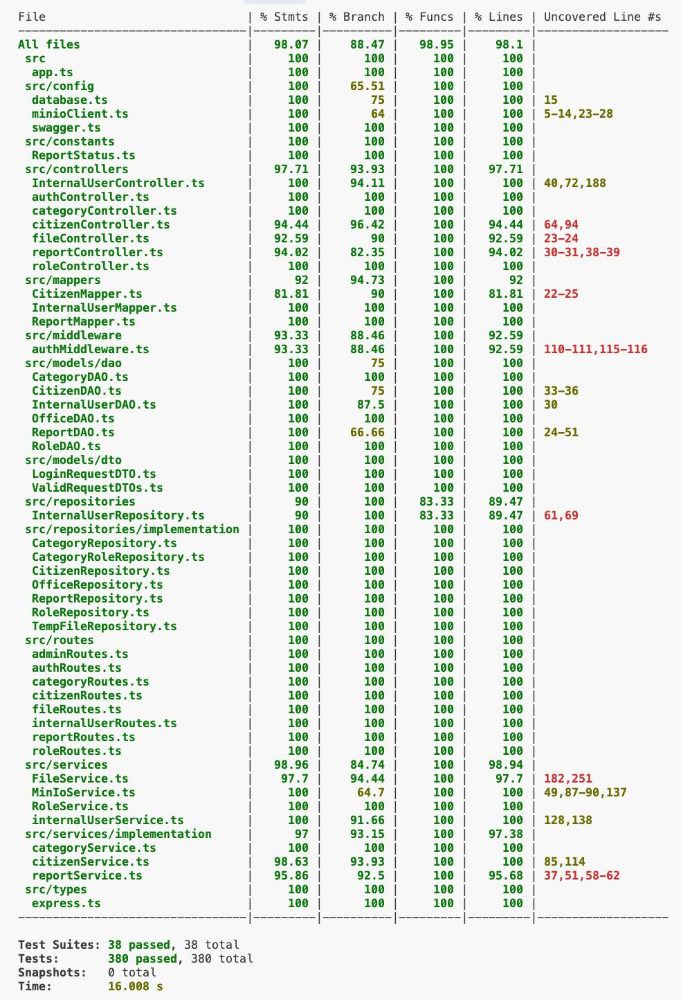

# RETROSPECTIVE (Team 18)

=====================================

Index:

- [process measures](#process-measures)
- [quality measures](#quality-measures)
- [general assessment](#assessment)

## PROCESS MEASURES

### Macro statistics

#### Number of stories committed vs. done

- Committed Stories: 4
- Stories Done: 4

#### Total points committed vs. done

- Committed Points: 27
- Points Done: 27

#### Nr of hours planned vs. spent (as a team)

- Planned Hours: 97h 00m
- Spent Hours: 96h 30m

##### Our definition of DONE

- Unit Tests passing
- Code review completed, approval from at least one other team member
- Code present on GitHub
- End-to-End tests performed
- Manual testing for frontend

#### Detailed statistics

| Story                             | # Tasks | Points | Hours est. | Hours actual |
| --------------------------------- | ------- | ------ | ---------- | ------------ |
| _Uncategorized_                   | 12      | 0      | 4d 0h 25m  | 4d 0h 50m    |
| 6 - Reports screening             | 17      | 8      | 2d 6h 25m  | 2d 5h 45m    |
| 7 - View reports by location      | 15      | 8      | 2d 3h 25m  | 2d 1h 30m    |
| 8 - Officer report overview       | 10      | 3      | 1d 3h 45m  | 1d 4h 15m    |
| 9 - Citizen configuration account | 9       | 8      | 1d 4h 0m   | 1d 5h 10m    |

- Hours per task average, standard deviation

|            | Mean   | StDev  |
| ---------- | ------ | ------ |
| Estimation | 1h 34m | 2h 06m |
| Actual     | 1h 33m | 2h 07m |

##### Total estimation error ratio = -0,005

##### Absolute relative task estimation = 0,154

## QUALITY MEASURES

### Backend testing

#### Unit Testing

- Total hours estimated = 6h 30m
- Total hours spent = 6h 45m
- Nr of automated unit test cases = 167

#### E2E testing

- Total hours estimated = 9h 00m
- Total hours spent = 11h 00m
- Nr of test cases = 30

### Frontend testing

#### Manual Testing

- Total hours estimated = 1h 15m
- Total hours spent = 0h 55m
- Nr of test cases = 66

### Code review

- Total hours estimated = 4h
- Total hours spent = 3h 40m

#### Coverage

## ASSESSMENT

### What did go wrong in the sprint?

### What caused your errors in estimation (if any)?

### What lessons did you learn (both positive and negative) in this sprint?

### Which improvement goals set in the previous retrospective were you able to achieve?

### Which ones you were not able to achieve? Why?

### Improvement goals for the next sprint and how to achieve them (technical tasks, team coordination, etc.)

### One thing you are proud of as a Team!!

