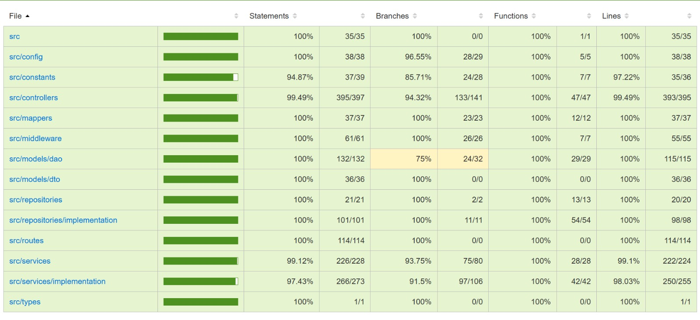

# RETROSPECTIVE (Team 18)

=====================================

Index:

- [process measures](#process-measures)
- [quality measures](#quality-measures)
- [general assessment](#assessment)

## PROCESS MEASURES

### Macro statistics

#### Number of stories committed vs. done

- Committed Stories: 2
- Stories Done: 2

#### Total points committed vs. done

- Committed Points: 18
- Points Done: 18

#### Nr of hours planned vs. spent (as a team)

- Planned Hours: 95h 30m
- Spent Hours: 95h 05m

##### Our definition of DONE

- Unit Tests passing
- Code review completed, approval from at least one other team member
- Code present on GitHub
- End-to-End tests performed
- Manual testing for frontend

#### Detailed statistics

| Story                                            | # Tasks | Points | Hours est. | Hours actual |
| ------------------------------------------------ | ------- | ------ | ---------- | ------------ |
| _Uncategorized_                                  | 25      | 0      | 7d 4h 00m  | 7d 3h 50m    |
| 24 - Assign reports to external maintainers      | 17      | 13     | 2d 6h 10m  | 2d 6h 5m     |
| 25 - Update status of a report (ext. maintainer) | 12      | 5      | 1d 5h 20m  | 1d 4h 40m    |

- Hours per task average, standard deviation

|            | Mean   | StDev  |
| ---------- | ------ | ------ |
| Estimation | 1h 46m | 2h 24m |
| Actual     | 1h 45m | 2h 24m |

##### Total estimation error ratio = -0,004

##### Absolute relative task estimation = 0,064

## QUALITY MEASURES

### Backend testing

#### Unit Testing

- Total hours estimated = 4h 00m
- Total hours spent = 4h 00m
- Nr of automated unit test cases = 141

#### E2E testing

- Total hours estimated = 3h 00m
- Total hours spent = 3h 00m
- Nr of test cases = 22

### Frontend testing

#### Manual Testing

- Total hours estimated = 2h 00m
- Total hours spent = 2h 00m
- Nr of test cases = 36

### Code review

- Total hours estimated = 4h 30m
- Total hours spent = 4h 35m

#### Coverage

## Techincal Debt

- Strategy adopted: primary goal is maintainability 

- Total hours estimated = 10h 40m
- Total hours spent = 10h 40m

## ASSESSMENT

- What caused your errors in estimation (if any)?

- What lessons did you learn (both positive and negative) in this sprint?

- Which improvement goals set in the previous retrospective were you able to achieve?
- Which ones you were not able to achieve? Why?

- Improvement goals for the next sprint and how to achieve them (technical tasks, team coordination, etc.)

> Propose one or two

- One thing you are proud of as a Team!!
