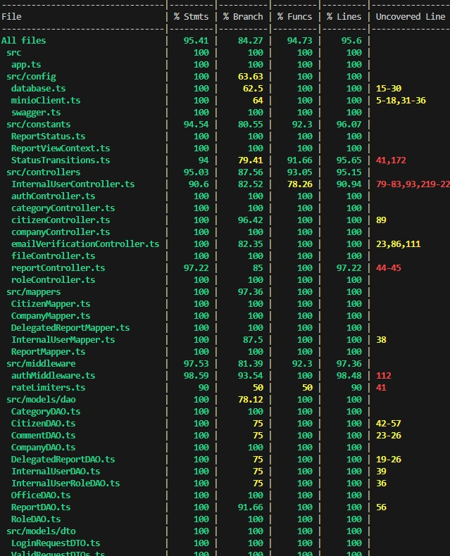

# RETROSPECTIVE (Team 18)

=====================================

Index:

- [process measures](#process-measures)
- [quality measures](#quality-measures)
- [general assessment](#assessment)

## PROCESS MEASURES

### Macro statistics

#### Number of stories committed vs. done

- Committed Stories: 6
- Stories Done: 6

#### Total points committed vs. done

- Committed Points: 36
- Points Done: 36

#### Nr of hours planned vs. spent (as a team)

- Planned Hours: 96h 05m
- Spent Hours: 95h 55m

##### Our definition of DONE

- Unit Tests passing
- Code review completed, approval from at least one other team member
- Code present on GitHub
- End-to-End tests performed
- Manual testing for frontend

#### Detailed statistics

| Story                                                | # Tasks | Points | Hours est. | Hours actual |
| ---------------------------------------------------- | ------- | ------ | ---------- | ------------ |
| _Uncategorized_                                      | 7       | 0      | 3d 1h 15m  | 3d 1h 10m    |
| 28 - Map view for unregistered citizen               | 6       | 3      | 0d 4h 15m  | 0d 4h 5m     |
| 26 - Exchange info and comments on report internally | 14      | 13     | 2d 7h 45m  | 2d 7h 40m    |
| 27 - Confirm registration with a code                | 15      | 8      | 2d 4h 00m  | 2d 4h 30m    |
| 15 - Choose whether make report anonimously          | 10      | 2      | 0d 7h 20m  | 0d 6h 15m    |
| 30 - Address search                                  | 3       | 2      | 0d 1h 30m  | 0d 1h 30m    |
| 10 - Modify municipality user roles                  | 13      | 8      | 1d 6h 00m  | 1d 6h 45m    |

- Hours per task average, standard deviation

|            | Mean   | StDev  |
| ---------- | ------ | ------ |
| Estimation | 1h 24m | 2h 10m |
| Actual     | 1h 24m | 2h 11m |

##### Total estimation error ratio = -0,0017

##### Absolute relative task estimation = 0,074

## QUALITY MEASURES

### Backend testing

#### Unit Testing

- Total hours estimated = 4h 30m
- Total hours spent = 4h 30m
- Nr of automated unit test cases = 65

#### E2E testing

- Total hours estimated = 5h 30m
- Total hours spent = 5h 30m
- Nr of test cases = 18

### Frontend testing

#### Manual Testing

- Total hours estimated = 3h 00m
- Total hours spent = 2h 45m
- Nr of test cases = 20

### Code review

- Total hours estimated = 5h 45m
- Total hours spent = 3h 45m

#### Coverage

## Techincal Debt

- Strategy adopted: primary goal is maintainability

- Total hours estimated = 0h 0m
- Total hours spent = 0h 0m

## ASSESSMENT

What caused your errors in estimation (if any)?

- Similarly to the previous sprint, due to excessive workload we had some diversions in the timeline.

What lessons did you learn (both positive and negative) in this sprint?

- The importance of keeping track of technical debt and the system up to date with the user requirements (positive), and learning best practices to write code more consistent and maintainable creating less issues for the future techincal debt (negative).

Which improvement goals set in the previous retrospective were you able to achieve?

- Testing was a success on both fronts, regression for the entire system (newly implemented and refactored features) manual testing for the client side part of the application.

Which ones you were not able to achieve? Why?

- All goals set in the previous retrospective were achieved

Improvement goals for the next sprint and how to achieve them (technical tasks, team coordination, etc.)

- Increasing the number of story points to be implemented while keeping the same level of time and technical debt management
- Stay on the same level of presentation and restrospective analysis

One thing you are proud of as a Team!!

- Through coordination of the members, goals such as, resolving technical debt, regression testing and implementing new features while keeping nearly the same time management (as made evident by the Burndown chart for both the actual and previous sprint) were successfully achieved.
